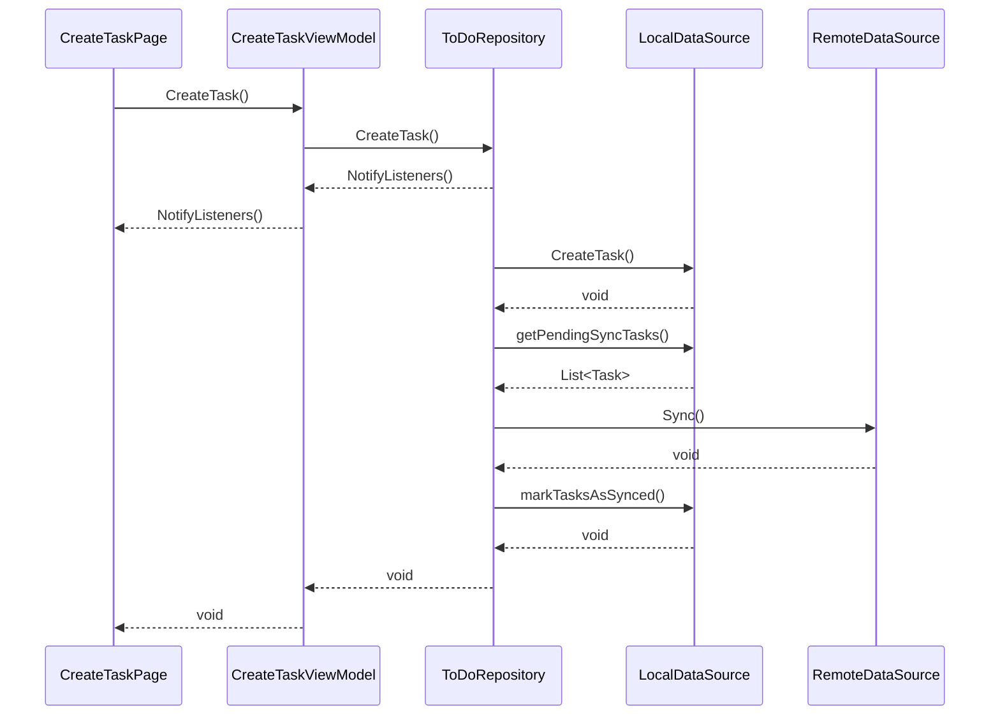
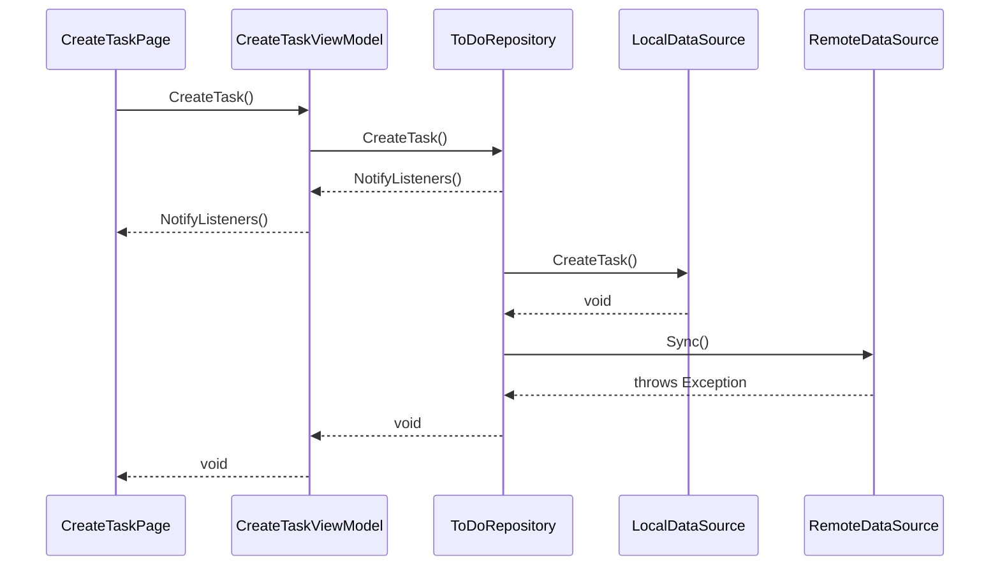

# Taski

Aplicativo de Tarefas (To-Do) para o teste técnico da WL-Consultings

## Visão Geral
 - [Testando a Aplicação](#testando-a-aplicação)
    - [Pré Requisitos](#pré-requisitos)
    - [Como Testar](#como-testar)
 - [Requisitos Funcionais](#requisitos-funcionais)
 - [Requisitos Não Funcionais](#requisitos-não-funcionais)
 - [Ideias de Features](#ideias-de-features)
 - [Arquitetura](#arquitetura)
 - [Fluxo de Cadastro de uma Tarefa](#fluxo-de-cadastro-de-uma-tarefa)
    - [Cadastro com o Dispositivo do Usuário Online](#cadastro-com-o-dispositivo-do-usuário-online)
    - [Cadastro com o Dispositivo do Usuário Offline](#cadastro-com-o-dispositivo-do-usuário-offline)

## Testando a Aplicação

### Pré Requisitos
1. Flutter instalado em seu computador. Use o [guia de instalação](https://docs.flutter.dev/get-started/install) oficial do Flutter.

2. Emulador android, simulador IOS ou dispositivo físico configurado em modo desenvolvedor

### Como Testar

1. Clone este repositório
```bash
git clone https://github.com/HenriqueFelixDev/taski-challenge.git
```
ou clique no botão , depois em **Download ZIP**. Após baixar o arquivo, descompacte-o.

2. Entre na pasta do projeto
```bash
cd taski-challenge
```

2. Baixe as dependências do projeto
```bash
flutter pub get
```

3. Executar a aplicação
```bash
flutter run
```

## Requisitos Funcionais
 - [ ] Listar tarefas a fazer (título e descrição)
 - [ ] Exibir a quantidade de tarefas a fazer
 - [ ] Marcar tarefa como concluída
 - [ ] Expandir/Ocultar a descrição da tarefa
 - [ ] Consultar tarefas pelo título ou descrição
 - [ ] Cadastrar tarefa (título e descrição)
 - [ ] Visualizar tarefas concluídas
 - [ ] Excluir tarefa concluída
 - [ ] Excluir todas as tarefas concluídas

## Requisitos Não Funcionais
 - [ ] O Aplicativo deve ser offline first
 - [ ] O Aplicativo deve ter testes automatizados

## Ideias de Funcionalidades
 - [ ] Desmarcar tarefa da lista de concluídas
 - [ ] Editar tarefas já cadastradas (descrição e título)
 - [ ] Colocar debounce na consulta de tarefas
 - [ ] Adicionar contador de tempo para cada tarefa (estilo Toggl)
 - [ ] Exportar relatório de tarefas

## Fluxo de Cadastro de uma Tarefa

Um dos requisitos não funcionais é do aplicativo ser [offline first](https://docs.flutter.dev/app-architecture/design-patterns/offline-first). Para isso ele salva a tarefa no banco de dados local (SQLite) e depois tenta sincronizar as tarefas que estão cadastradas somente localmente com a fonte de dados remota (pode ser firebase, api rest, etc). Em caso de erro na sincronia, o repository trata internamente, não estourando o erro em outras camadas pois a tarefa já foi salva localmente.

Abaixo há dois diagramas exemplificando o fluxo de chamadas aos métodos de cada classe quando o dispositivo do usuário está online e offline.

### Cadastro com o Dispositivo do Usuário Online

### Cadastro com o Dispositivo do Usuário Offline


Outro conceito utilizado aqui é o de [optmistic state](https://docs.flutter.dev/app-architecture/design-patterns/optimistic-state) em que a aplicação sempre considera que a ação vai ser executada com sucesso. Com isso a aplicação já adiciona a tarefa à lista de tarefas sem a necessidade do usuário esperar a inserção dela no banco de dados, tornando a experiência do usuário mais fluida e responsiva.

Em caso de erro, basta remover a tarefa que foi adicionada anteriormente e exibir alguma mensagem informando que não foi possível adicionar a tarefa.
